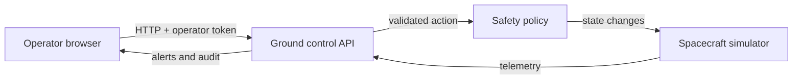

# Mission Guard

**Spacecraft Cybersecurity, Ground Control Protection, and Autonomous Mission Safety** — an educational Level 6 oral exam demonstrator.

## Run

Requires Python 3.10+. No packages or cloud account needed.

```bash
python app.py
```

Open http://127.0.0.1:8765. The default local demo token is `demo-operator-token`. To choose one: `MISSION_TOKEN=my-secret python app.py` and enter it in the UI. `MISSION_PORT` changes the port.

## What to demonstrate

1. Advance telemetry to show normal monitoring.
2. Trigger a solar storm. A critical alert opens and deterministic onboard policy enters SAFE mode.
3. Propose `RESUME_NORMAL`, then approve it. The interlock blocks unsafe resumption.
4. Restore nominal conditions, propose and approve `RESUME_NORMAL` again.
5. Trigger a ground-link outage and restart the link through an approved command.
6. Click **Simulate unauthorized access** to send three invalid command requests. Observe rejection, audit events, and a HIGH security alert.
7. Explain the audit events, network trust boundary, command allowlist, and recovery behavior.

## Architecture



The API runs on loopback by default. `/api/state` reads the current simulation. `/api/action` accepts a token and an allowlisted action, handles it under a lock, and returns updated state. The browser refreshes from the response. No external network calls are made. State is in memory and resets on restart.

## Security and failure decisions

- Three invalid command requests from one source within 60 seconds raise a HIGH security alert; each is rejected and audited. This is detection, not IP blocking.
- A token gates mutations, but the default token is public and this is **not production authentication**. Read access is public on the local host. For actual operations use TLS, identity provider, roles, hardware backed keys, signed commands, and independent approvers.
- Approval is a workflow simulation, **not true two-person approval**. A single local operator can both propose and approve. A production system needs separate identities and an append-only external audit store.
- Autonomous SAFE mode remains available when the ground link is down. An unsafe resume is blocked even if approved. Recovery requires nominal conditions and an explicit resume command.
- Radiation ≥70 mSv/h, battery ≤15%, or temperature ≥55 °C enter SAFE. Battery ≤25%, temperature ≥45 °C, and link outage trigger alerts.
- The “AI-driven” concept in the exam topic is represented here by a transparent, deterministic decision policy. There is **no trained ML model**; describe a future model as an extension, not as implemented functionality.
- Telemetry is simulated, no spacecraft or actual ground station is connected. No persistence, multiuser support, secure deployment, or real cryptographic telemetry verification is claimed.

See [architecture and Q&A notes](docs/EXAM_NOTES.md).
