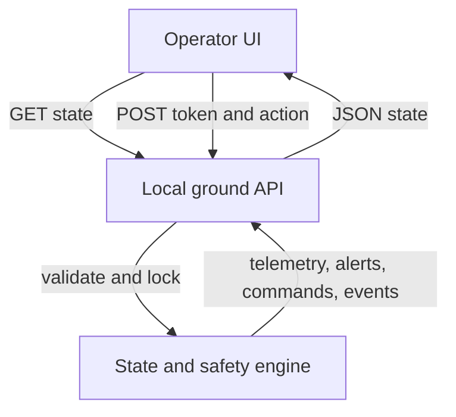
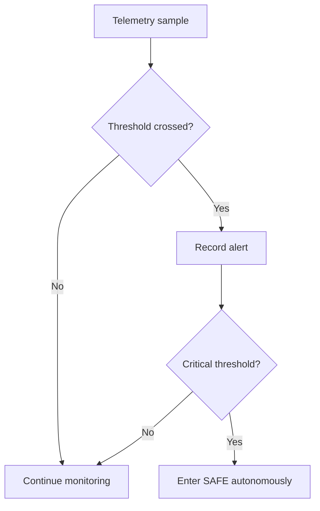

# Oral exam explanation and defense

## One minute overview

Mission Guard demonstrates how a ground control dashboard receives spacecraft telemetry, detects hazardous conditions, and protects the spacecraft using an autonomous safety policy. An operator may propose commands, but the system checks the command against an allowlist and a safety interlock before execution. Alerts and actions appear in an audit feed. The prototype simulates telemetry and runs locally.

## Data flow and trust boundary

The browser is untrusted input. The API checks the token on all mutations, limits request size, accepts only named scenarios and commands, and applies the interlock server side. The token is a demo mechanism, not a production security boundary. Escaping dynamic text in the UI reduces injection risk.

## Process flow

## Cybersecurity demonstration

Use **Simulate unauthorized access**. The browser sends three intentionally invalid command requests. The server returns 401 for each, records SECURITY audit events without recording credentials, and opens a HIGH alert after the third failure within 60 seconds from one source. No proposed command is created. This is simple failed-authentication detection, not a penetration test or production intrusion detection system.

## Deployment and recovery

Local deployment is `python app.py`, loopback only. Restarting resets state and loses audit history. In a real deployment, isolate the spacecraft network from public interfaces, authenticate device telemetry, use a message broker with durable queues, separate the command authorization service, replicate ground control, and store signed audit events in durable storage. During link loss, spacecraft safety decisions must operate independently; after reconnection, reconcile event sequence numbers and verify telemetry integrity before allowing normal operations.

## Design trade-offs and likely Q&A

1. **Why autonomous SAFE mode?** Communication delay or outage makes ground-only safety decisions too slow.
2. **Why thresholds instead of ML?** Predictable, inspectable behavior is easier to validate for safety. ML may help detect subtle patterns later, but should not alone authorize critical commands.
3. **What if telemetry is spoofed?** This demo does not defend against it. A production system would authenticate sources, sign messages, validate sequence numbers, and cross-check sensors.
4. **What if the link fails?** The local safety policy still enters SAFE; remote commands depend on link restoration.
5. **What if an operator sends RESUME during a storm?** The server blocks it, marks the command BLOCKED, and logs the reason.
6. **Why require approval?** It makes the control flow visible, but this demo's approval is not independent. Production requires distinct roles and identities.
7. **Where is audit stored?** In memory only. Restart loses it. Production requires tamper-evident durable storage.
8. **How does it scale?** Separate telemetry ingestion, detection, command authorization, and storage into services; partition by spacecraft and use queues.
9. **What is the main security boundary?** Between the operator browser and ground API; spacecraft-ground communications would add a second boundary in production.
10. **How do you recover?** Restore nominal telemetry, verify link health, then explicitly approve a resume command. No automatic resume after an incident.
11. **Why no real cloud?** The local demonstrator keeps the exam reproducible and clearly separates implemented features from a future deployment.
12. **How would you test?** Verify critical thresholds, alert deduplication, unauthorized actions, command allowlist, unsafe resume blocking, and recovery.
